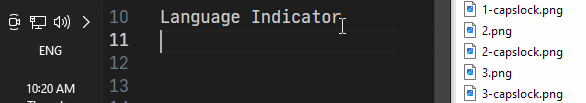
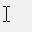
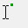
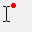
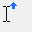
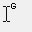

# My Beam

## Enables Per-Language Cursor Styling (Language Indicator).

This script keeps track of your current language/input method and changes your mouse cursor based on a list of cursors in the `./cursors/` folder.
The cursor might also be altered when Caps Lock is on.

## Features

-   Reliable: Works everywhere, including consoles and Universal Windows Apps (aka Metro apps).
-   Customizable: Add, change, or delete cursors in ./cursors/ to personalize the look for different input languages and Caps Lock states, for example `./cursors/2-capslock.cur`.

## Installation

1. Download `my-beam.exe` + `cursors` folder.
2. (Optional) Remove unwanted, or add your own cursors to the `./cursors/` folder.
3. Create shortcut for `my-beam.exe` (the compiled AHKv2-64 script).
4. Move shortcut to startup folder. For Windows 10, this is typically `%appdata%\Microsoft\Windows\Start Menu\Programs\Startup`

## Custoimization

- Written for [AHK v2](https://www.autohotkey.com/docs/v2/).  
- Supported cursor file formats: CUR, ANI, ICO.  
- Create your ow cursor with [Sib Cursor Editor](http://www.sibcode.com/cursor-editor/).  
- Currently, the script mainly affects the text selection cursor (`ibeam`), but this can be changed within the script.  
- Types of custom cursors included:  

Cheers!

