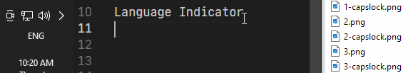

# Language Indicator

## Per-Language Styling of Text Caret and Mouse Cursor

Keeps track of your current language and changes [caret](https://en.wikipedia.org/wiki/Caret_navigation) and [text selection mouse cursor](<https://en.wikipedia.org/wiki/Cursor_(user_interface)#I-beam_pointer>).

It works in most envs, including consoles and Universal Windows Apps, aka Metro apps.  
Exceptions are Adobe Indesign and some .NET MAUI apps.

Written for [AHK v2](https://www.autohotkey.com/docs/v2/).

## Installation

1. Download [`language-indicator.exe`](language-indicator.exe), a standalone [compiled](https://github.com/AutoHotkey/Ahk2Exe) version of the script
2. Download and run [`install.cmd`](install.cmd) to create shortcut at startup folder

Standalone version of the script creates a marker near the mouse cursor <ins>with lag</ins>. Since cursors cannot be embedded directly into an AHK script, this lag can be eliminated by adding `cursors` folder. See below for details.

## Customization

1. Download or create [`carets`](./carets) or [`cursors`](./cursors) folders (since `cursors` folder exist, embedded images won't be used, see [`./lib/image-utils/UseBase64Image.ahk`](./lib/image-utils/UseBase64Image.ahk))
2. Remove unwanted or add your own carets or mouse cursors within [`carets`](./carets) or [`cursors`](./cursors) folders
3. Use the following naming convention:

| Input                  | Mouse Cursor               | Text Caret Mark           |
| :--------------------- | :------------------------- | :------------------------ |
| Language 2             | `./cursors/2.cur`          | `./carets/2.png`          |
| Language 1 + Caps Lock | `./cursors/1-capslock.cur` | `./carets/1-capslock.png` |
| Language 2 + Caps Lock | `./cursors/2-capslock.cur` | `./carets/2-capslock.png` |

Tips:

- Supported caret mark formats: PNG, GIF
- Supported cursor file formats: CUR, ANI, ICO, PNG
    - CUR, ANI, ICO: Replace the system cursor (no lag)
    - PNG: Paints a floating mark near the cursor (with lag, same as embedded images)
- Create your own cursor with [Sib Cursor Editor](http://www.sibcode.com/cursor-editor/)

Enjoy!  
A donut, [maybe](https://www.paypal.com/donate/?business=KXM47EKBXFV4S&no_recurring=0&item_name=funding+of+github.com%2Fyakunins&currency_code=USD)? 🍩
