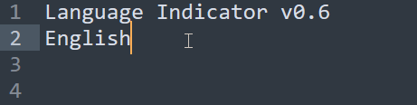

# Language Indicator for Windows

## Per-Language Styling of Text Caret and Mouse Cursor

Keeps track of your current keyboard language/layout and changes [caret](https://en.wikipedia.org/wiki/Caret_navigation) and [text selection mouse cursor](<https://en.wikipedia.org/wiki/Cursor_(user_interface)#I-beam_pointer>).

It works in most envs, including consoles and Universal Windows Apps, aka Metro apps.
Exceptions are Adobe Indesign and some .NET MAUI apps.

Built with [AutoHotkey v2](https://www.autohotkey.com/v2/). Executable compiled with [Ahk2Exe](https://github.com/AutoHotkey/Ahk2Exe).

## Installation

1. Download and unzip the [latest release](../../releases/latest)
2. Run `install.cmd` to create a shortcut in your startup folder

The release includes `cursors` and `carets` folders for lag-free cursor replacement. Standalone version (without `/cursors/`) paints a marker near the mouse cursor <ins>with lag</ins>. See [Customization](#customization) for details.

## Customization

1. Download or create [`carets`](./carets) or [`cursors`](./cursors) folders (since `cursors` folder exist, embedded images won't be used, see [`./lib/image-utils/UseBase64Image.ahk`](./lib/image-utils/UseBase64Image.ahk))
2. Remove unwanted or add your own carets or mouse cursors within [`carets`](./carets) or [`cursors`](./cursors) folders
3. Use the following naming convention:

| Input                  | Mouse Cursor               | Text Caret Mark           |
| :--------------------- | :------------------------- | :------------------------ |
| Language 2             | `./cursors/2.cur`          | `./carets/2.png`          |
| Language 1 + Caps Lock | `./cursors/1-capslock.cur` | `./carets/1-capslock.png` |
| Language 2 + Caps Lock | `./cursors/2-capslock.png` | `./carets/2-capslock.png` |

## Country Flags as Indicators

1. Create a `carets` or `cursors` folder
2. Copy a flag from [`img/flags-png/`](./img/flags-png/) (e.g., `es.png`)
3. Rename it to match your language number (e.g., `2.png`)

## Supported Formats

| Folder    | Formats       | Notes                                  |
| --------- | ------------- | -------------------------------------- |
| `carets`  | PNG, GIF      | Floating mark next to text caret       |
| `cursors` | CUR, ANI, ICO | Replaces system cursor (no lag)        |
| `cursors` | PNG           | Floating mark near cursor (slight lag) |

Enjoy!  
A donut, [maybe](https://www.paypal.com/donate/?business=KXM47EKBXFV4S&no_recurring=0&item_name=funding+of+github.com%2Fyakunins&currency_code=USD)? 🍩
